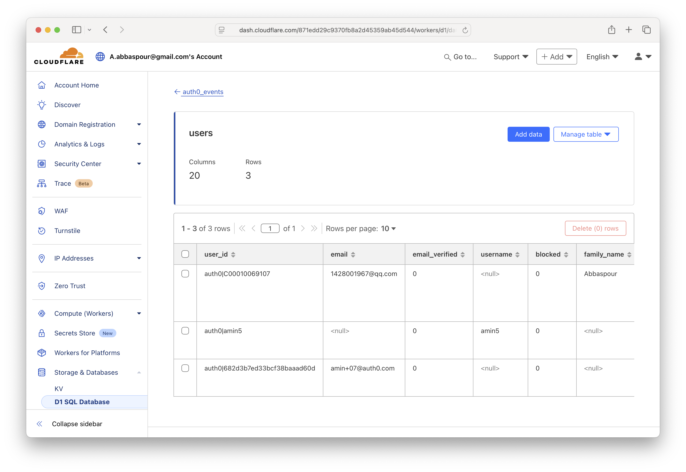
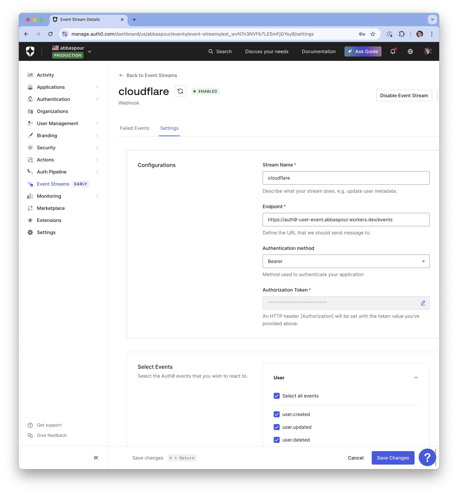

# Auth0 User Event Worker

A Cloudflare Worker that receives webhook requests from Auth0 event streams and persists user entities in a D1 SQLite database.

## Features

- Receives Auth0 webhook events on the `/events` endpoint
- Logs incoming webhook data
- Uses D1 SQLite database for data persistence
- Built with TypeScript for type safety
- Uses Hono framework for routing and request handling

## Setup

### Prerequisites

- [Node.js](https://nodejs.org/) (v14 or later)
- [Wrangler CLI](https://developers.cloudflare.com/workers/wrangler/get-started/) (Cloudflare Workers CLI)

### Installation

1. Clone this repository
2. Install dependencies:

```bash
npm install
```

3. Create a D1 database using Wrangler:

```bash
wrangler d1 create auth0_events
```

4. Update the `wrangler.toml` file with your database ID from the previous step. When you create the database, Wrangler will output something like:

    ```
    ✅ Successfully created DB 'auth0_events' in location LOCATION_NAME
    Created D1 database '12345678-1234-1234-1234-123456789abc'
    ```

    Copy the UUID (e.g., `12345678-1234-1234-1234-123456789abc`) and replace the `database_id` value in `wrangler.toml`.

5. Create the users table in your D1 database:

```bash
wrangler d1 execute auth0_events --remote --command "DROP TABLE users"
wrangler d1 execute auth0_events --remote --command "CREATE TABLE users (
  user_id TEXT PRIMARY KEY,
  email TEXT,
  email_verified BOOLEAN DEFAULT FALSE,
  username TEXT,
  blocked BOOLEAN DEFAULT FALSE,
  family_name TEXT,
  given_name TEXT,
  name TEXT,
  nickname TEXT,
  phone_number TEXT,
  phone_verified BOOLEAN DEFAULT FALSE,
  created_at TIMESTAMP,
  updated_at TIMESTAMP,
  picture TEXT,
  user_metadata TEXT,
  app_metadata TEXT,
  identities TEXT,
  raw_user TEXT,
  inserted_at TIMESTAMP DEFAULT CURRENT_TIMESTAMP,
  last_event_processed TIMESTAMP
)"
```

6. Create an API_TOKEN to secure connection between Auth0 and your worker:

```bash
export API_TOKEN=`openssl rand -hex 32`
echo "API_TOKEN=$API_TOKEN" > .env
echo $API_TOKEN

wrangler secret put API_TOKEN
```

### Development

To run the worker locally:

```bash
npm run dev # using npm
make dev    # using make
```

### Deployment

To deploy the worker to Cloudflare:

```bash
npm run deploy  # using npm
make deploy     # using make
```

### Building

To build the project:

```bash
npm run build # using npm
make build    # using make
```

## Usage

Send POST requests with JSON payloads to the `/events` endpoint. The worker will log the received data and respond with a success message.

Example:

```bash
curl -X POST https://auth0-user-event.<your-subdomain>.workers.dev/events \
  -H "Content-Type: application/json" \
  -H "Authorization: Bearer ${API_TOKEN}" \
  -d @./events/sample-user-created.json
```

To monitor the log:

```bash
wrangler tail
```

Access the database from command line:

```bash
wrangler d1 execute auth0_events --remote --command "SELECT * FROM users"
```

As well as Cloudflare dashboard:


## Auth0 Setup

Add a Webhook listener to Event Streams for all user events with URL pointing to your worker
at https://auth0-user-event.<your-subdomain>.workers.dev/events and Bearer Authorization with $API_TOKEN from step 6.



## Project Structure

- `src/index.ts` - Main worker code
- `wrangler.toml` - Cloudflare Worker configuration
- `package.json` - Project dependencies and scripts
- `tsconfig.json` - TypeScript configuration
- `webpack.config.js` - Webpack bundling configuration
- `Makefile` - Build and deployment automation
